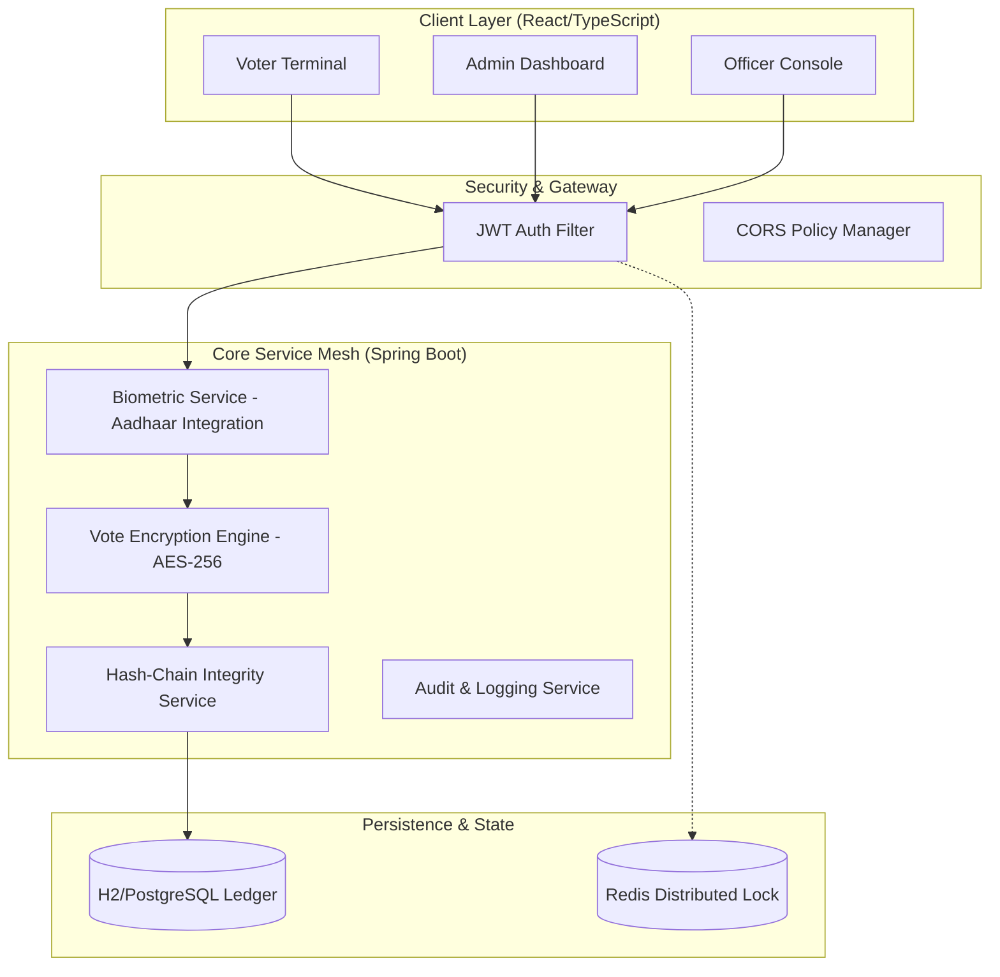

# VoteSecure: Enterprise-Grade Biometric Remote Voting Protocol

VoteSecure is a high-integrity, decentralized-style voting platform designed for national-scale elections. It integrates **Aadhaar Biometric Identity Verification** with a **Cryptographic Hash-Chain Ledger** to solve the three core challenges of remote voting: **Identity Assurance, Ballot Secrecy, and End-to-End Verifiability.**

---

## 🏗️ System Architecture



---

## 🛠️ Technical Specification

### 1. Identity Assurance (Biometric Multi-Factor)
The system implements a mock **UIDAI CIDR Integration**. Before a ballot is issued, the system performs a 1:1 biometric match against the voter's Aadhaar-linked fingerprint hash. 
- **Protocol:** SHA-256 Hashing of Biometric Templates.
- **Security:** Raw Aadhaar numbers and fingerprints are never stored; only one-way salts/hashes are used for verification.

### 2. Cryptographic Integrity (The Hash-Chain)
To prevent database-level tampering, every vote is cryptographically linked to the one preceding it.
- **Mechanism:** `Current_Vote_Hash = SHA256(Vote_Data + Previous_Vote_Hash)`
- **Verifiability:** The Admin Dashboard provides a "Verify Chain" tool that re-calculates the entire ledger to prove no records have been added, deleted, or modified.

### 3. Ballot Secrecy (Payload Encryption)
Votes are encrypted at the service layer using **AES-256 encryption**.
- **Privacy:** Even database administrators cannot see who voted for whom.
- **Tallying:** Votes are only decrypted and tallied once the Election Administrator officially "Starts the Counting" process.

---

## 🚀 Deployment & Orchestration

### Enterprise Deployment (Render/Docker)
The system is containerized for seamless scaling and zero-downtime deployments.
- **Orchestration:** [render.yaml](file:///d:/votesecure/render.yaml) (Infrastructure as Code)
- **Container:** [Dockerfile](file:///d:/votesecure/Dockerfile) (Multi-stage Alpine Build)

### Local Development Environment
1. **Prerequisites:** Java 21+, Node 18+, Maven 3.9+.
2. **Execution:**
   ```bash
   # Start Backend Services
   mvn spring-boot:run
   
   # Start Frontend Application
   cd frontend && npm install && npm run dev
   ```

---

## 🔐 Access Control Matrix

| Persona | Permissions | Authentication |
| :--- | :--- | :--- |
| **Voter** | Cast Single Ballot | Biometric + Aadhaar Hash |
| **Booth Officer** | Unlock Terminal | JWT + Role-Based Auth |
| **Election Admin** | Manage Lifecycle / Audit | MFA + System Admin Auth |

---

## 📊 Analytics & Transparency
The Admin Dashboard provides real-time transparency:
- **Hash Chain Status:** Continuous monitoring of ledger integrity.
- **Turnout Mismatch Detection:** Compares physical turnout vs. ledger count to detect ghost voting.
- **Encrypted Tallying:** Mathematical verification of results after election closure.

---
*Disclaimer: This architecture is a reference implementation for secure remote voting protocols and should be integrated with official government identity APIs for production use.*
